# Querying An Azure Cosmos DB Database using the SQL API

In this lab, you will query an Azure Cosmos DB database instance using the SQL language. You will use features common in SQL such as projection using SELECT statements and filtering using WHERE clauses. You will also get to use features unique to Azure Cosmos DB's SQL API such as projection into JSON, intra-document JOIN and filtering to a range of partition keys.

## Setup

*Before you start this lab, you will need to create an Azure Cosmos DB database and collection that you will use throughout the lab. You will also use the **Data Migration Tool** to import existing data into your collection.*

### Download Required Files

*A JSON file has been provided that will contain a collection 50,000 students. You will use this file later to import documents into your collection.*

1. Download the [students.json](files/students.json) file and save it to your local machine.

### Create Azure Cosmos DB Database and Collection

*You will now create a database and collection within your Azure Cosmos DB account.*

1. On the left side of the portal, click the **Resource groups** link.

    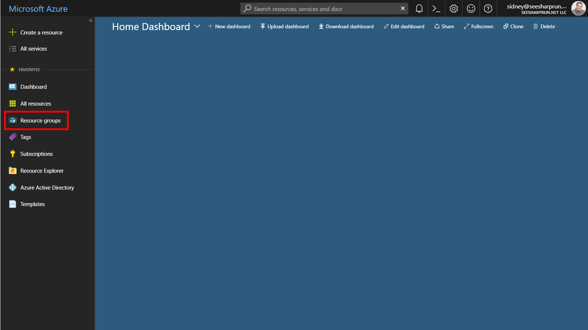

1. In the **Resource groups** blade, locate and select your previously created *Resource Group*.

    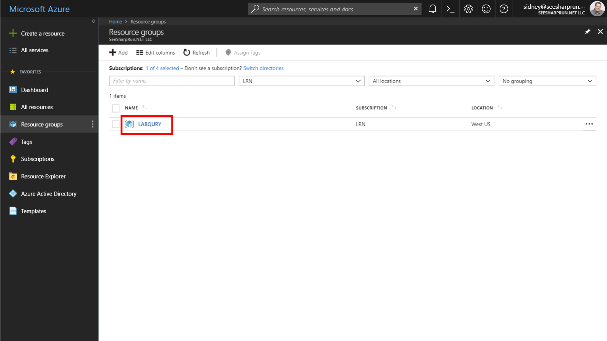

1. In the **LABQURY** blade, select the **Azure Cosmos DB** account you recently created.

    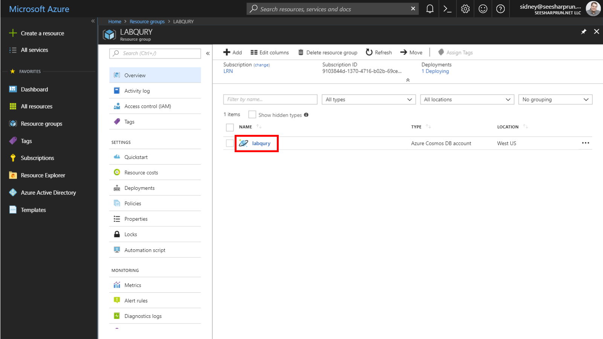

1. In the **Azure Cosmos DB** blade, locate and click the **Overview** link on the left side of the blade.

    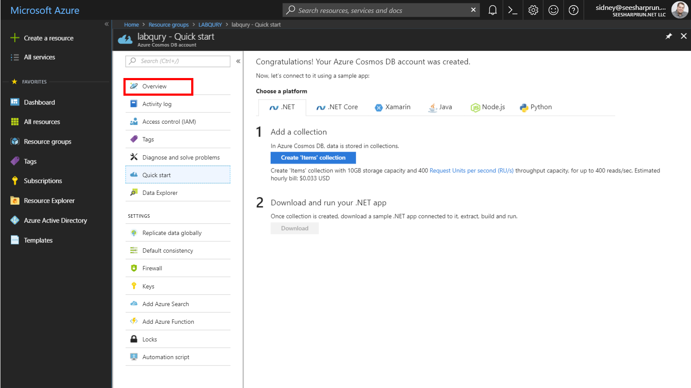

1. At the top of the **Azure Cosmos DB** blade, click the **Add Collection** button.

    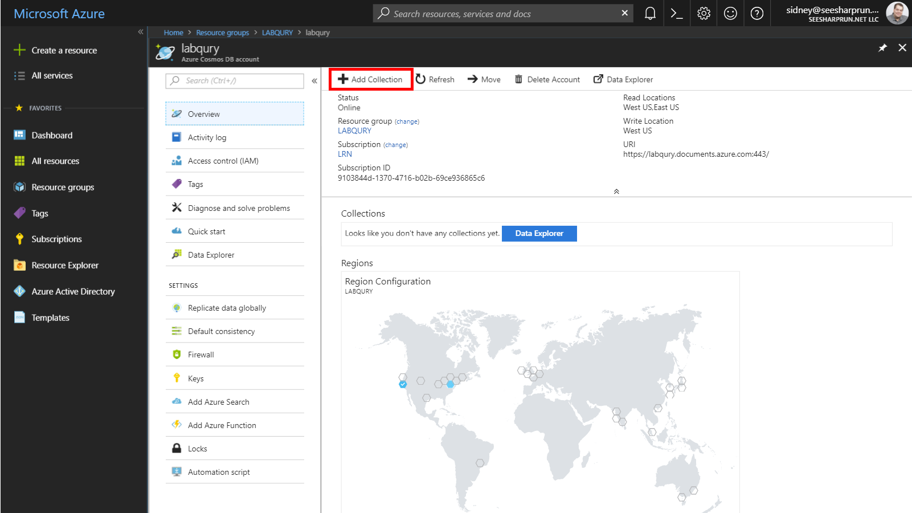

1. In the **Add Collection** popup, perform the following actions:

    1. In the **Database id** field, enter the value **UniversityDatabase**.

    1. In the **Collection id** field, enter the value **StudentCollection**.

    1. In the **Storage capacity** section, select the **Unlimited** option.

    1. In the **Partition key** field, enter the value ``/enrollmentYear``.

    1. In the **Throughput** field, enter the value ``11000``.

    1. Click the **+ Add Unique Key** link.

    1. In the new **Unique Keys** field, enter the value ``/studentAlias``.

    1. Click the **OK** button.

    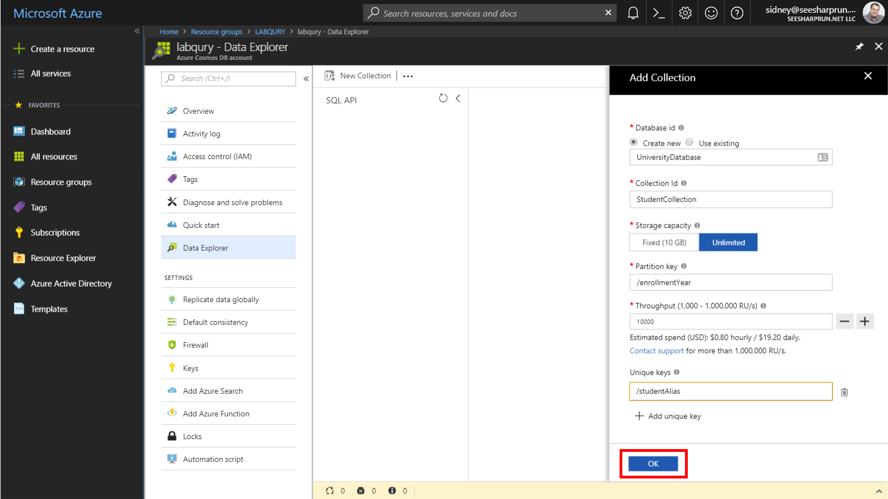

1. Wait for the creation of the new **database** and **collection** to finish before moving on with this lab.

### Retrieve Account Credentials

*The Data Migration Tool and .NET SDKs both require credentials to connect to your Azure Cosmos DB account. You will collect and store these credentials for use throughout the lab.*

1. On the left side of the **Azure Cosmos DB** blade, locate the **Settings** section and click the **Keys** link.

    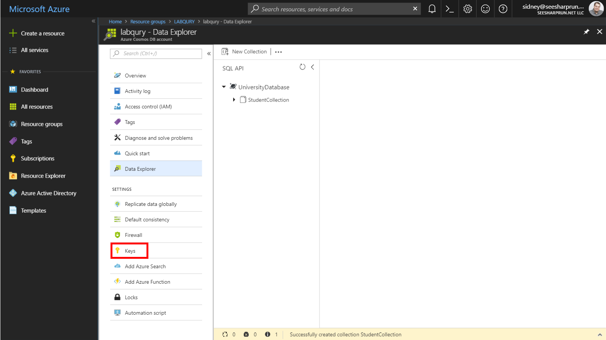

1. In the **Keys** pane, record the values in the **URI** and **PRIMARY KEY** fields. You will use these values later in this lab.

    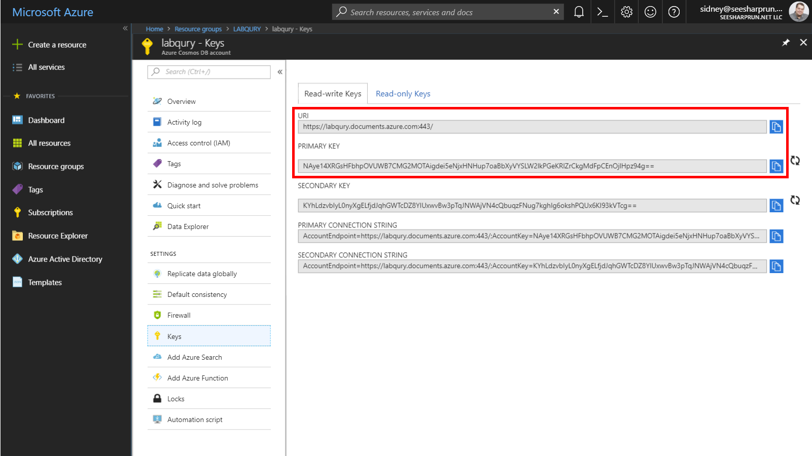

### Import Lab Data Into Collection

*Finally, you will import the JSON documents contained in the **students.json** file you downloaded earlier in this lab. You will use the **Data Migration Tool** to import the JSON array stored in the **students.json** file from your local machine to your Azure Cosmos DB collection.

1. On your local machine, open the **Azure Cosmos DB Data Migration Tool**.

1. In the **Welcome** step of the tool, click the **Next** button to begin the migration wizard.

    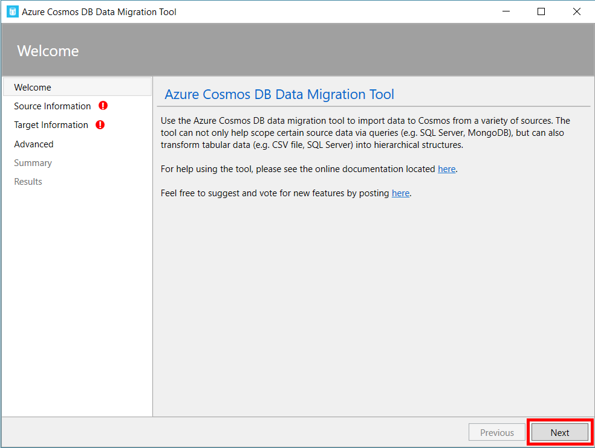

1. In the **Source Information** step of the tool, perform the following actions:

    1. In the **Import from** list, select the **JSON file(s)** option.

    1. Click the **Add Files** button.

    1. In the *Windows Explorer* dialog that opens, locate and select the **students.json** file you downloaded earlier in this lab. Click the **Open** button to add the file.

    1. Select the **Decompress data** checkbox.

    1. Click the **Next** button.

    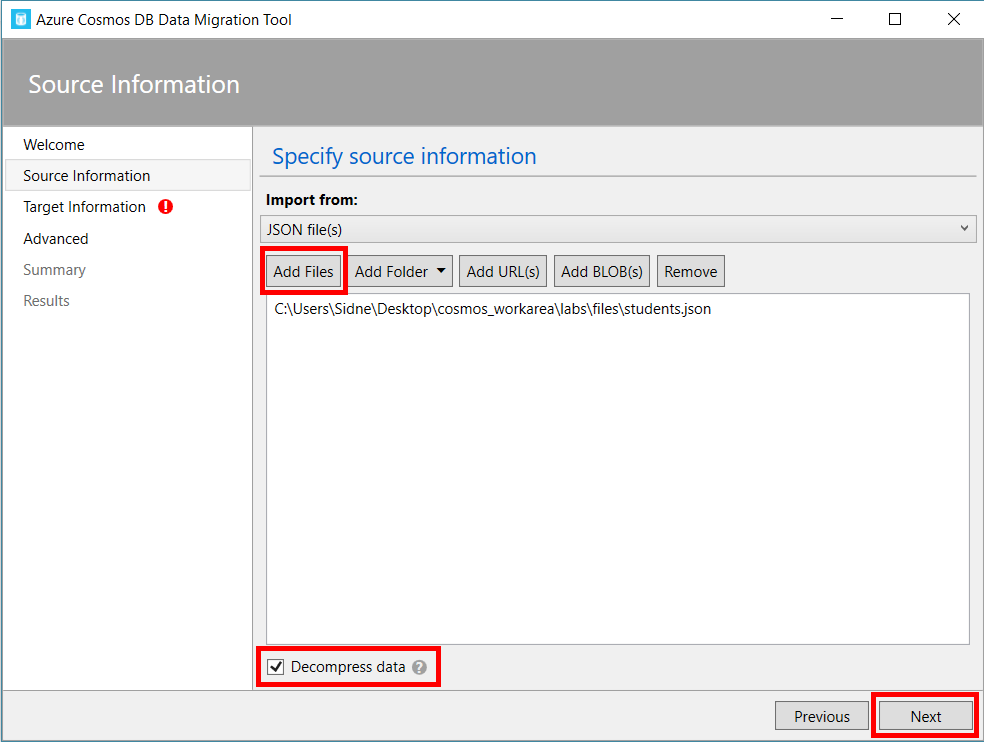

1. In the **Target Information** step of the tool, perform the following actions:

    1. In the **Export to** list, select the **Azure Cosmos DB - Sequential record import (partitioned collection)** option.

    1. In the **Connection String** field, enter a newly constructed connection string replacing the placeholders with values from your Azure Cosmos DB account recorded earlier in this lab: ```AccountEndpoint=[uri];AccountKey=[key];Database=[database name];```. *Make sure you replace the **[uri]**, **[key]**, and **[database name]** placeholders with the corresponding values from your Azure Cosmos DB account. For example, if your **uri** is ``https://cosmosacct.documents.azure.com:443/``, your **key** is ``Get0qW1BrqxRUA9BskSRHti5HHzrp1cjTUJTBMIbxgCGXQgRWh5NZvhc0jIt4A5ZoljA2YiLxjNHtrfC6Bd2fA==`` and your **database's name** is ``UniversityDatabase``, then your connection string will look like this: ```AccountEndpoint=https://cosmosacct.documents.azure.com:443/;AccountKey=Get0qW1BrqxRUA9BskSRHti5HHzrp1cjTUJTBMIbxgCGXQgRWh5NZvhc0jIt4A5ZoljA2YiLxjNHtrfC6Bd2fA==;Database=UniversityDatabase;```*

    1. Click the **Verify** button to validate your connection string.

    1. In the **Collection** field, enter the value **StudentCollection**.

    1. In the **Partition Key** field, enter the value ``/enrollmentYear``.

    1. In the **Collection Throughput** field, enter the value ``11000``.

    1. Click the **Advanced Options** button.

    1. In the **Number of Parallel Requests** field, increment the value from ``10`` to ``100``.

    1. Click the **Next** button.

    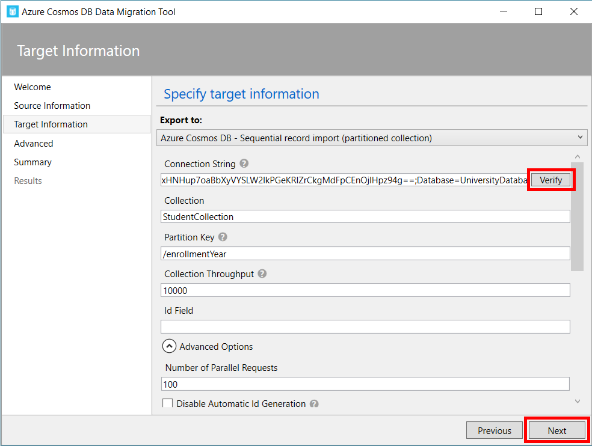

1. In the **Advanced** step of the tool, leave the existing options set to their default values and click the **Next** button.

    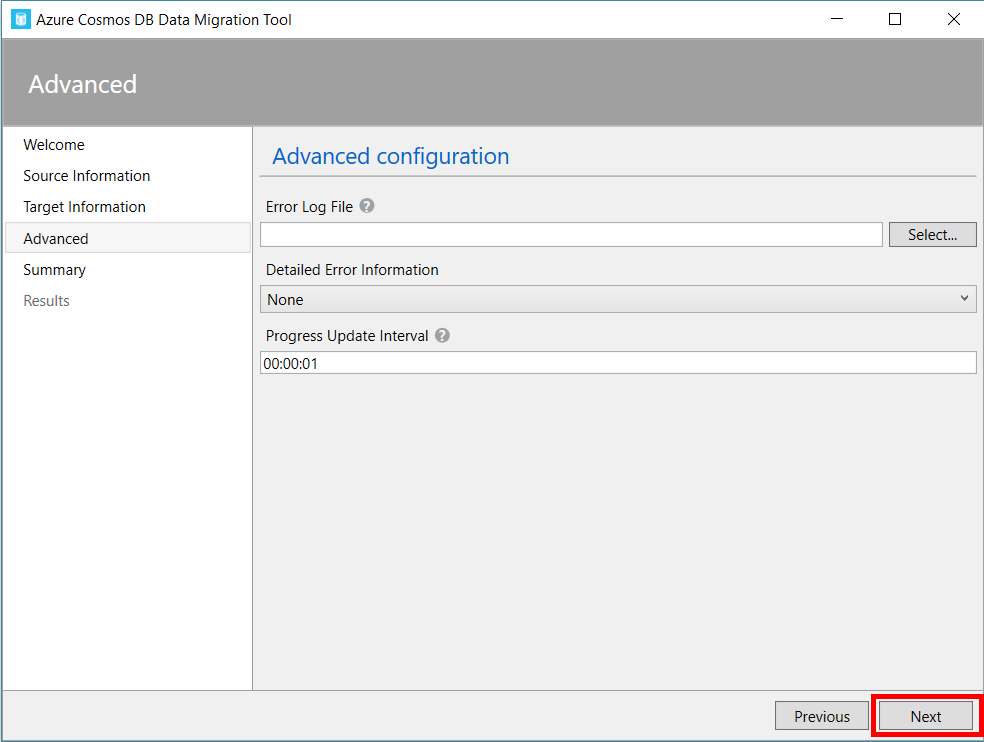

1. In the **Summary** step of the tool, review your options and then click the **Import** button.

    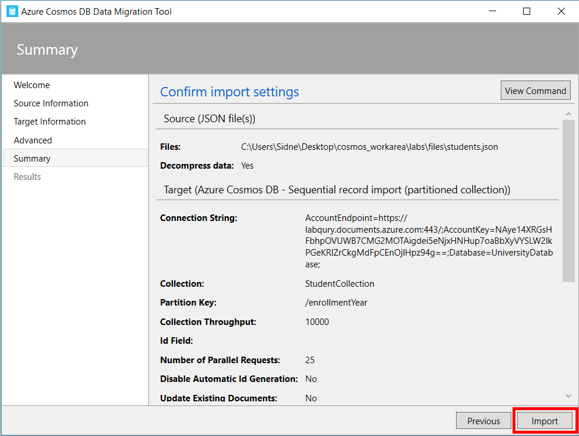

1. Wait for the import process to complete.

    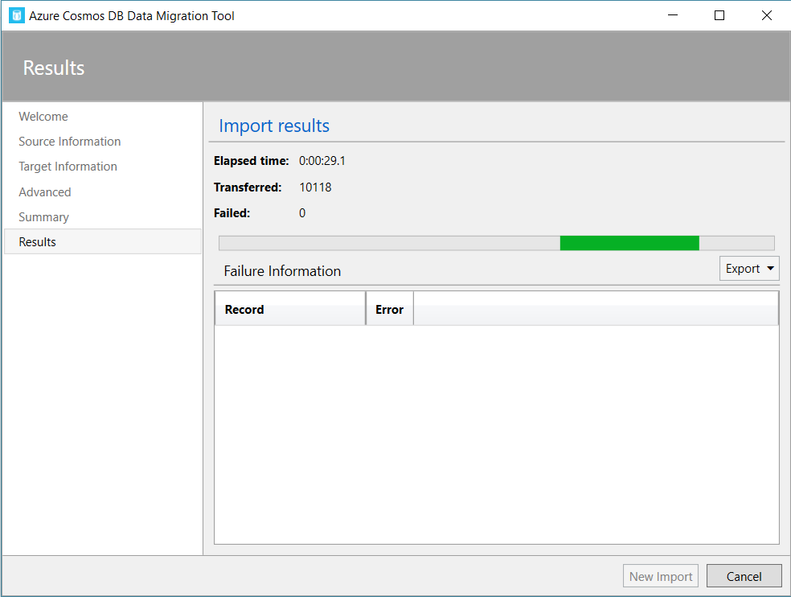

    > You will know that the tool has run successfully once it has transferred 50000 records and the progress bar's animation ends. This step can take two to three minutes.

    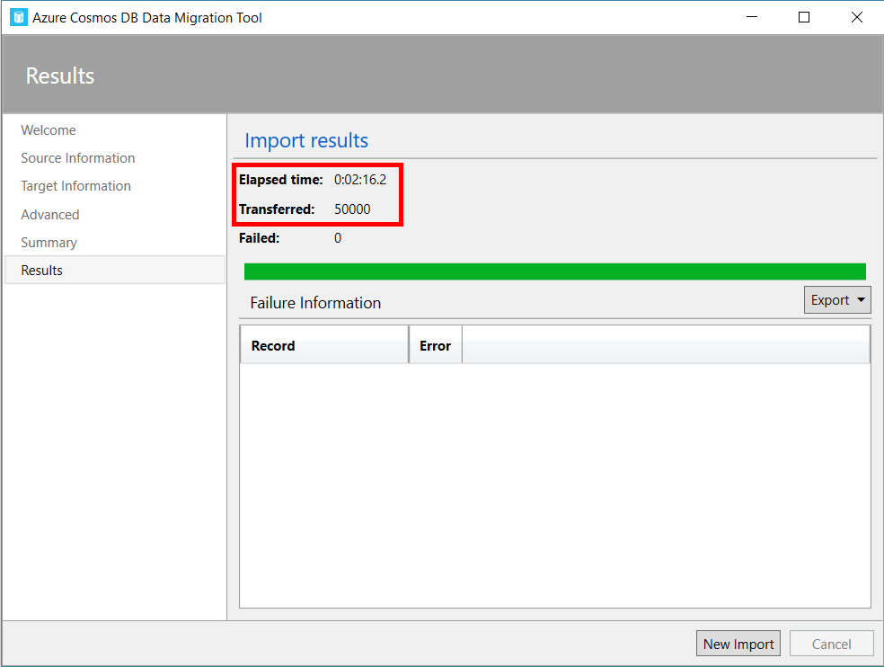

1. Once the import process has completed, close the Azure Cosmos DB Data Migration Tool.

## Executing Simple Queries

*The Azure Cosmos DB Data Explorer allows you to view documents and run queries directly within the Azure Portal. In this exercise, you will use the Data Explorer to query the data stored in our collection.*

### Validate Imported Data

*First, you will validate that the data was successfully imported into your collection using the **Documents** view in the **Data Explorer**.*

1. Return to the **Azure Portal** (<http://portal.azure.com>).

1. On the left side of the portal, click the **Resource groups** link.

    

1. In the **Resource groups** blade, locate and select the **LABQURY** *Resource Group*.

    

1. In the **LABQURY** blade, select the **Azure Cosmos DB** account you recently created.

    

1. In the **Azure Cosmos DB** blade, locate and click the **Data Explorer** link on the left side of the blade.

    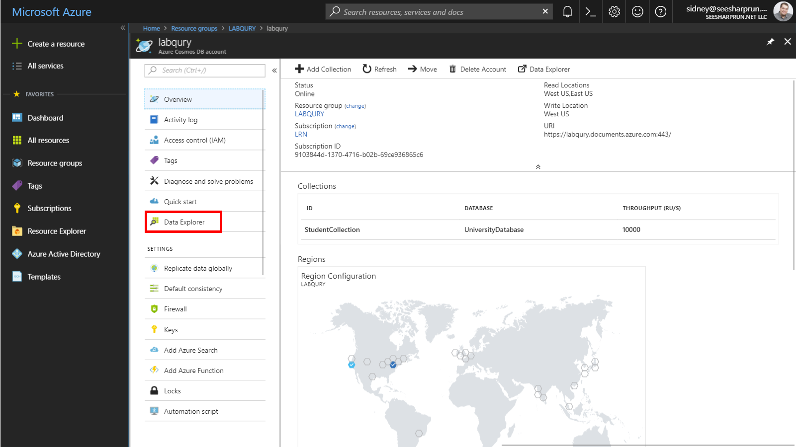

1. In the **Data Explorer** section, expand the **UniversityDatabase** database node and then expand the **StudentCollection** collection node. 

    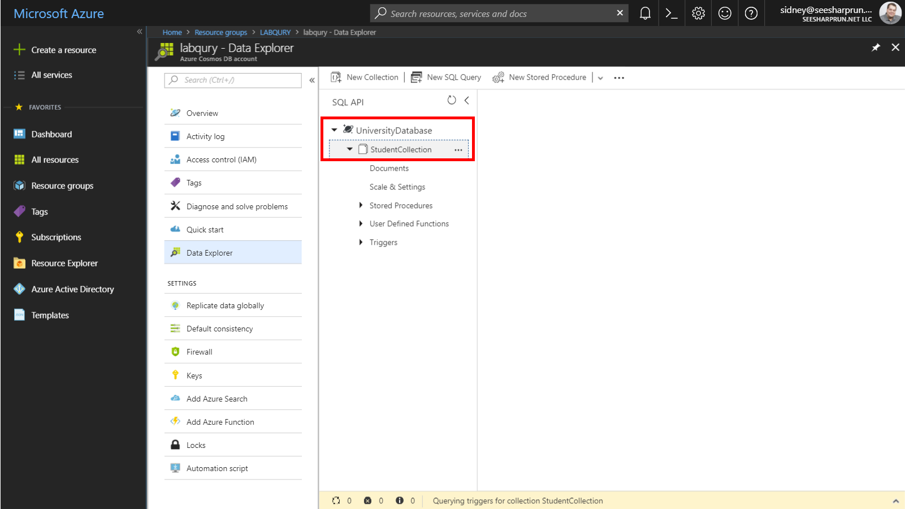

1. Within the **StudentCollection** node, click the **Documents** link to view a subset of the various documents in the collection. Select a few of the documents and observe the properties and structure of the documents.

    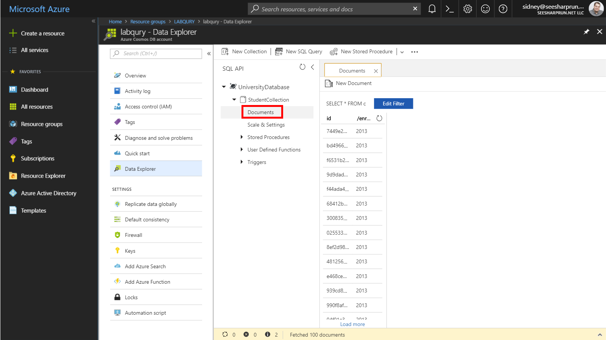

    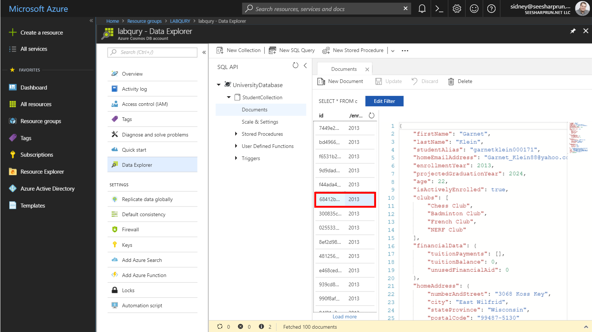

### Executing a Simple SELECT Queries

*You will now use the query editor in the **Data Explorer** to execute a few simple SELECT queries using SQL syntax.*

1. Click the **New SQL Query** button at the top of the **Data Explorer** section.

    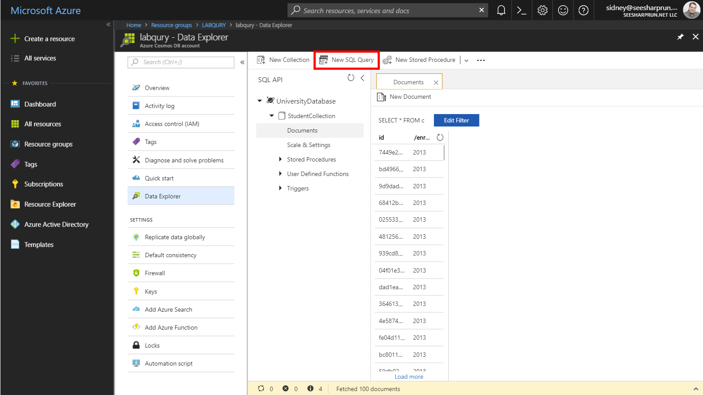

1. In the query tab, replace the contents of the *query editor* with the following SQL query:

    ```sql
    SELECT * FROM students s WHERE s.enrollmentYear = 2017
    ```

    > This first query will select all properties from all documents in the collection where the students where enrolled in 2017. You will notice that we are using the alias ``s`` to refer to the collection.

    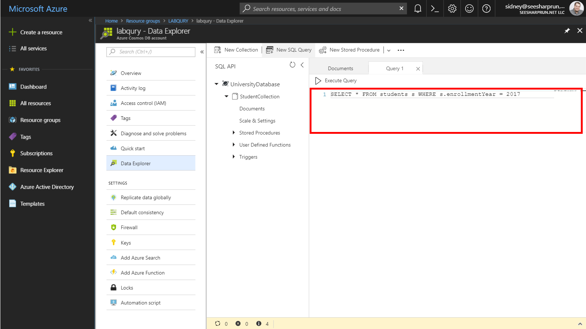

1. Click the **Execute Query** button in the query tab to run the query. 

    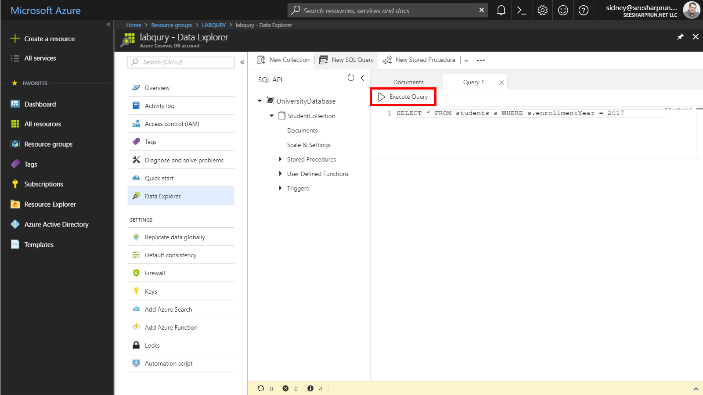

1. In the **Results** pane, observe the results of your query.

    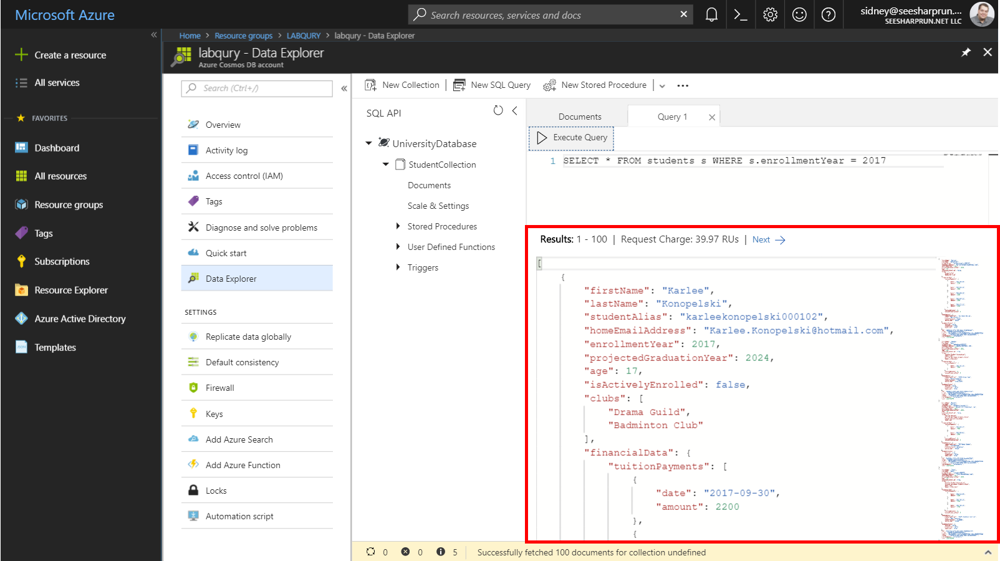

1. In the *query editor*, replace the current query with the following query:

    ```sql
    SELECT * FROM students WHERE students.enrollmentYear = 2017
    ```

    > In this query, we drop the ``s`` alias and use the ``students`` source. When we execute this query, we should see the same results as the previous query.

1. Click the **Execute Query** button in the query tab to run the query. In the **Results** pane, observe the results of your query.

1. In the *query editor*, replace the current query with the following query:

    ```sql
    SELECT * FROM arbitraryname WHERE arbitraryname.enrollmentYear = 2017
    ```

    > In this query, we will prove that the name used for the source can be any name you choose. We will use the name ``arbitraryname`` for the source. When we execute this query, we should see the same results as the previous query.

1. Click the **Execute Query** button in the query tab to run the query. In the **Results** pane, observe the results of your query.

1. In the *query editor*, replace the current query with the following query:

    ```sql
    SELECT s.studentAlias FROM students s WHERE s.enrollmentYear = 2017
    ```

    > Going back to ``s`` as an alias, we will now create a query where we only select the ``studentAlias`` property and return the value of that property in our result set.

1. Click the **Execute Query** button in the query tab to run the query. In the **Results** pane, observe the results of your query.

1. In the *query editor*, replace the current query with the following query:

    ```sql
    SELECT VALUE s.studentAlias FROM students s WHERE s.enrollmentYear = 2017
    ```

    > In some scenarios, you may need to return a flattened array as the result of your query. This query uses the ``VALUE`` keyword to flatten the array by taking the single returned (string) property and creating a string array.

1. Click the **Execute Query** button in the query tab to run the query. In the **Results** pane, observe the results of your query.

### Implicitly Executing a Cross-Partition Query

*The Data Explorer will allow you to create a cross-partition query without the need to manually configure any settings. You will now use the query editor in the Data Explorer to perform single or multi-partition queries*

1. Back in the query tab, replace the contents of the *query editor* with the following SQL query:

    ```sql
    SELECT * FROM students s WHERE s.enrollmentYear = 2016 
    ```

    > Since we know that our partition key is ``/enrollmentYear``, we know that any query that targets a single valid value for the ``enrollmentYear`` property will be a single partition query.

1. Click the **Execute Query** button in the query tab to run the query. In the **Results** pane, observe the results of your query.

    > Observe the Request Charge (in RU/s) for the executed query.

1. In the *query editor*, replace the current query with the following query:

    ```sql
    SELECT * FROM students s
    ```

    > If we want to execute a blanket query that will fan-out to all partitions, we simply can drop our ``WHERE`` clause that filters on a single valid value for our partition key path.

1. Click the **Execute Query** button in the query tab to run the query. In the **Results** pane, observe the results of your query.

    > Observe the Request Charge (in RU/s) for the executed query. You will notice that the charge is relatively greater for this query.

1. Back in the query tab, replace the contents of the *query editor* with the following SQL query:

    ```sql
    SELECT * FROM students s WHERE s.enrollmentYear IN (2015, 2016, 2017)
    ```

    > Observe the Request Charge (in RU/s) for the executed query. You will notice that the charge is greater than a single partition but far less than a fan-out across all partitions.

1. Click the **Execute Query** button in the query tab to run the query. In the **Results** pane, observe the results of your query.

    > Observe the Request Charge (in RU/s) for the executed query.

### Use Built-In Functions

*There are a large variety of built-in functions available in the SQL query syntax for the SQL API in Azure Cosmos DB. We will focus on a single function in this task but you can learn more about the others here: [https://docs.microsoft.com/azure/cosmos-db/sql-api-sql-query-reference](https://docs.microsoft.com/azure/cosmos-db/sql-api-sql-query-reference#bk_built_in_functions)*

1. In the *query editor*, replace the current query with the following query:

    ```sql
    SELECT s.studentAlias FROM students s WHERE s.enrollmentYear = 2015
    ```

    > Our goal is to get the school-issued e-mail address for all students who enrolled in 2015. We can issue a simple query to start that will return the login alias for each student.

1. Click the **Execute Query** button in the query tab to run the query. In the **Results** pane, observe the results of your query.

1. In the *query editor*, replace the current query with the following query:

    ```sql
    SELECT CONCAT(s.studentAlias, '@contoso.edu') AS email FROM students s WHERE s.enrollmentYear = 2015
    ```

    > To get the school-issued e-mail address, we will need to concatenate the ``@contoso.edu`` string to the end of each alias. We can perform this action using the ``CONCAT`` built-in function.

1. Click the **Execute Query** button in the query tab to run the query. In the **Results** pane, observe the results of your query.

1. In the *query editor*, replace the current query with the following query:

    ```sql
    SELECT VALUE CONCAT(s.studentAlias, '@contoso.edu') FROM students s WHERE s.enrollmentYear = 2015
    ```

    > In most client-side applications, you likely would only need an array of strings as opposed to an array of objects. We can use the ``VALUE`` keyword here to flatten our result set.

1. Click the **Execute Query** button in the query tab to run the query. In the **Results** pane, observe the results of your query.

### Projecting Query Results

*In some use cases, we may need to reshape the structure of our result JSON array to a structure that our libraries or third-party APIs can parse. We will focus on a single query and re-shape the results into various formats using the native JSON capabilities in the SQL query syntax.*

1. In the *query editor*, replace the current query with the following query:

    ```sql
    SELECT 
        CONCAT(s.firstName, " ", s.lastName), 
        s.academicStatus.warning, 
        s.academicStatus.suspension, 
        s.academicStatus.expulsion,
        s.enrollmentYear,
        s.projectedGraduationYear
    FROM students s WHERE s.enrollmentYear = 2014
    ```

    > In this first query, we want to determine the current status of every student who enrolled in 2014. Our goal here is to eventually have a flattened, simple-to-understand view of every student and their current academic status.

1. Click the **Execute Query** button in the query tab to run the query. In the **Results** pane, observe the results of your query.

    > You will quickly notice that the value representing the name of the student, using the ``CONCAT`` function, has a placeholder property name instead of a simple string.

1. In the *query editor*, replace the current query with the following query:

    ```sql
    SELECT 
        CONCAT(s.firstName, " ", s.lastName) AS name, 
        s.academicStatus.warning, 
        s.academicStatus.suspension, 
        s.academicStatus.expulsion,
        s.enrollmentYear,
        s.projectedGraduationYear
    FROM students s WHERE s.enrollmentYear = 2014
    ```

    > We will update our previous query by naming our property that uses a built-in function.

1. Click the **Execute Query** button in the query tab to run the query. In the **Results** pane, observe the results of your query.

1. In the *query editor*, replace the current query with the following query:

    ```sql
    SELECT {
        "name": CONCAT(s.firstName, " ", s.lastName), 
        "isWarned": s.academicStatus.warning, 
        "isSuspended": s.academicStatus.suspension, 
        "isExpelled": s.academicStatus.expulsion,
        "enrollment": {
            "start": s.enrollmentYear,
            "end": s.projectedGraduationYear
        }
    } AS studentStatus
    FROM students s WHERE s.enrollmentYear = 2014
    ```

    > Another alternative way to specify the structure of our JSON document is to use the curly braces from JSON. At this point, we are defining the structure of the JSON result directly in our query. 

1. Click the **Execute Query** button in the query tab to run the query. In the **Results** pane, observe the results of your query.

    > You should notice that our JSON object is still "wrapped" in another JSON object. Essentially, we have an array of the parent type with a property named ``studentStatus`` that contains the actual data we want.

1. In the *query editor*, replace the current query with the following query:

    ```sql
    SELECT VALUE {
        "name": CONCAT(s.firstName, " ", s.lastName), 
        "isWarned": s.academicStatus.warning, 
        "isSuspended": s.academicStatus.suspension, 
        "isExpelled": s.academicStatus.expulsion,
        "enrollment": {
            "start": s.enrollmentYear,
            "end": s.projectedGraduationYear
        }
    } FROM students s WHERE s.enrollmentYear = 2014
    ```

    > If we want to "unwrap" our JSON data and flatten to a simple array of like-structured objects, we need to use the ``VALUE`` keyword.

1. Click the **Execute Query** button in the query tab to run the query. In the **Results** pane, observe the results of your query.